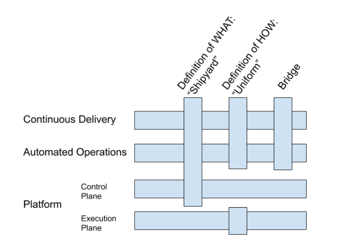

# Keptn User Stories

This is the outcome of the meetings from Jan. 29th and Jan. 30th. It defines user stories and the shipyard/uniform/... files that are required for this.

## User Stories

**Standard Keptn 0.6.0 Scenario**

- [Keptn_0.6.0](standard_v060/): This use story shows the standard flow as implemented in Keptn 0.6.0.

### Continuous Delivery

- [Canary Release on K8s](canary_k8s/): As a user, I want to do a canary release on K8s

- [Release Brackets](release_brackets/): As a user, I want to queue services in staging and finally release them together (even in a canary-way).

- As a user, I want to activate an approval step for any Keptn task (switch from an automatic to a manual mode)
  - As a user, I want to override (force/skip) an approval step

- As a user, I want to involve an existing CD pipeline, e.g., to execute tests.
  - I want to involve external services into the process (e.g., trigger a testing server running outside of the Keptn-cluster)​
  - I want to register a webhook for a Keptn project, stage, service, and action: `keptn register webhook http://abc.com/deploy --project --stage --service --action=test`
  - I want to tell Keptn that the execution of a task has finished. 

### Automated Operations

- As a user, I want to define a custom remediation workflow with multiple actions.

- As a user, I want to get a notification for a problem including data from multiple sources. 

### Platform - Execution Plane:

- As a user, I want to deploy my artifacts on different target systems (multiple clusters, AWS Lambda, …) using blue/green, primary/canary, etc.

- As a user, I want to modify/control the used service mesh.

### Platform - Control Plane:

- As a user, I want to run Keptn (core) standalone (e.g., using Docker compose)​ 

### Shipyard (Definition of WHAT, Process)

- As a user, I want to define custom processes in the shipyard (i.e., approval before deploying to production, tests of dark-deployments, etc.)​

### Uniform (Definition of HOW, Tooling): 

- [Web/Docker Hooks](hooks/): 
  - As a user, I want to register a webhook for a Keptn project, stage, service and action

  - As a user, I want to provide a Docker image which is used for tests/remediations​

- [Custom Keptn Services](custom_services/): As a user, I want to extend my Keptn installation with additional (custom) services

- As a user, I want to extend my workflow/process:
  - `keptn update shipyard "sli_provider+=prometheus,neoload"` // add prometheus and neoload as sli prov.​
  - `keptn update uniform --stage=hardening "tests+=selenium"` // add selenium tests for stage hardening​

### GitOps - GitFlow

- (GitOps) As a user, I want to update the configuration in my Git repo which is afterwards applied.​
  - I want to be able to edit my deployments in the Git repo (adding a new environment variable, changing cpu/memory limits), and Keptn should apply it​

- (GitOps) As a user, I want to onboard already deployed services/deployments [on another cluster]​
  - I want to be able to re-create a deployment that Keptn stores in a Git Repo on another cluster (potentially even without needing to install Keptn, just with kubectl apply -f https://github.com/some-user/my-project.git)​

- (GitFlow) ... *TBD* 